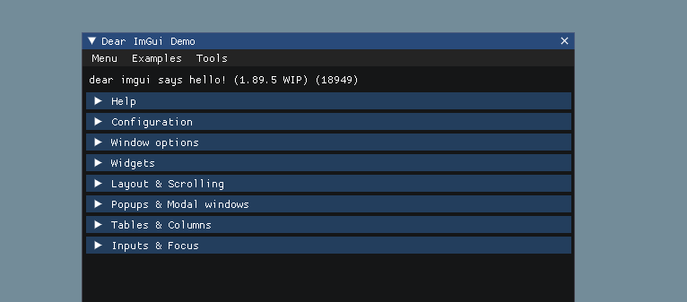

<p align="center">
    
</p>
<h1 align="center">Dear ImGui Example</h1>
<p align="center"><strong>A cross-platform Dear ImGui demo based on OpenGL3 with GLFW</strong></p>
<p align="center">
    
</p>

## Usage

```bash
# Creates GNU makefiles with premake
$ ./vendor/premake5 gmake

# Compiles with GCC
$ make

# Runs demo
$ ./bin/Debug-linux-x86_64/Demo/Demo
```

### *Clean*

```bash
# Cleans all make compilation files
$ make clean

# Cleans all premake makefiles and folders
$ ./vendor/premake5 clean
```
